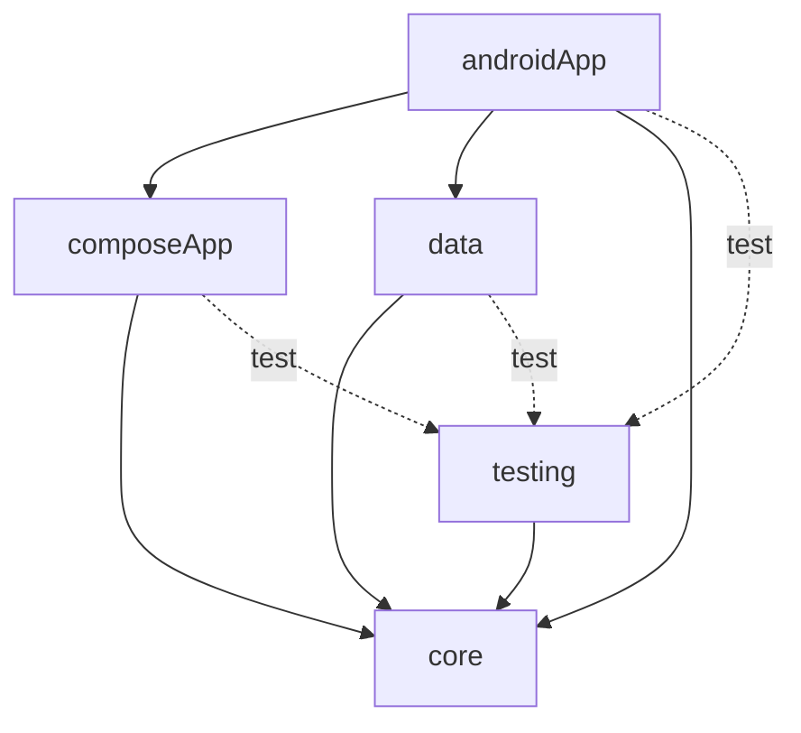
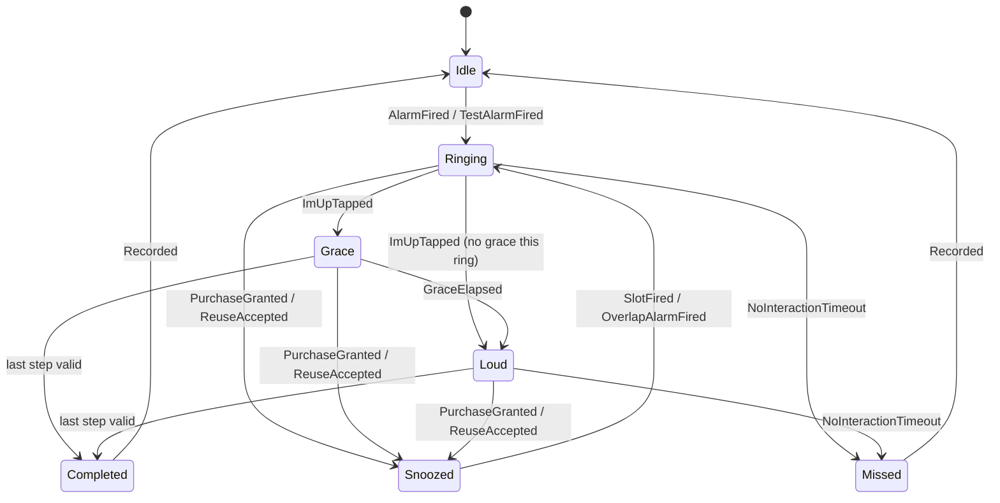
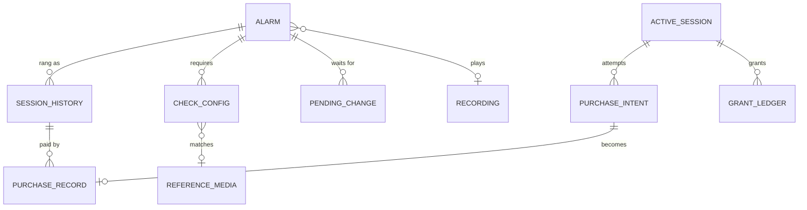
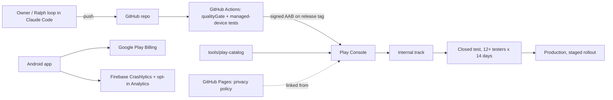

# Architecture Spine — Yawn & Pawn

## Design Paradigm

**Hexagonal (ports and adapters).** All product rules live in a pure-Kotlin `core` (commonMain only). Everything that touches the platform (alarms, audio, billing, camera, storage, background work, analytics) is a **port** (interface) in `core`, implemented by an **adapter** in `data` or `androidApp`. The wake flow is one explicit **state machine** in `core`. UI follows **unidirectional data flow**: a ViewModel exposes `StateFlow<UiState>`, receives `Intent`s; composables are stateless.

| Layer | Module | Holds |
|---|---|---|
| Domain core | `:core` (KMP, commonMain only) | Entities, `SessionConfig` resolver, fee ladder, snooze availability, session state machine, purchase reconciler and ledger rules, check plugins, stats, ports |
| Data adapters | `:data` (KMP) | Room KMP databases, DataStore, repository implementations of core ports |
| UI | `:composeApp` (KMP, Compose Multiplatform) | Generated theme tokens, screens, ViewModels, navigation, check UIs; camera preview in `androidMain` |
| Platform adapters + app | `:androidApp` (Android application) | AlarmManager, receivers, `WakeService`, `WakeActivity`, Play Billing, CameraX/ML Kit/MediaPipe, audio, WorkManager, Firebase, Koin wiring, screenshot tests |
| Test support | `:testing` (KMP) | Fakes for every core port, fixed clocks, builders |



## Invariants & Rules

### AD-1 — Core is platform-free [ADOPTED]

- **Binds:** all; NFR-11, NFR-12
- **Prevents:** Android types leaking into business logic, which would block iOS reuse and make logic untestable on the JVM.
- **Rule:** `:core` has only commonMain sources and depends only on Kotlin stdlib, kotlinx-coroutines, kotlinx-datetime and kotlinx-serialization. No `android.*`, `androidx.*`, Compose, Room or Koin imports. Dependency direction is exactly the graph above; `:composeApp` never depends on `:data`. A Gradle check fails the build if `:core` declares any other dependency.

### AD-2 — One owner of the wake session

- **Binds:** FR-ALM-4, FR-ALM-8, FR-ALM-9, FR-SES-*, FR-RNG-*, FR-PWK-9..11, PRD §6.4
- **Prevents:** screens, services and receivers each mutating session state and disagreeing about whether the alarm should ring.
- **Rule:**
  1. The session is a pure reducer in `:core`: `reduce(state, event, now): Transition(state, oneShotEffects)`, plus `entryEffects(state)` (idempotent: "sound is playing at X", "slot alarm armed at T", "wake UI shown"). Only `SessionEngine` (single instance, serialized by a Mutex) calls it.
  2. Each transition is committed to `runtime.db` in one transaction (session state, and ledger rows per AD-7) **before** its effects run. On `ProcessRestored`, only `entryEffects` run; one-shot effects are never replayed. On restore, `paying` is cleared and billing is never relaunched; the outcome is recovered by AD-7 reconciliation. A restored ring gets a fresh 30-minute interaction deadline (PRD §6.4).
  3. `SessionState` owns: `sessionId`, frozen `SessionConfig` (AD-16), `ringIndex`, `snoozesGranted`, `CheckRun` (plan, seeds, step, failed attempts, `fallbackUsed`), `paying: PurchaseIntentId?`, `unlocking` (with `paying`: the keyguard dismiss before billing, Spike S1), `noGraceThisRing`, `paused`, `paymentPending`, `declinedReuseProduct`, `paid` (Money list for the session line), and all deadlines as `Deadline(wallMillis, elapsedMillis, bootCount)` (AD-3).
  4. Adapters never change session state; they execute effects and feed results back as events. UI sends only user events (`ImUpTapped`, `CheckAnswerSubmitted`, `SnoozeTapped`, `PayConfirmed`, `ReuseAccepted`, `ReuseDeclined`, `FallbackRequested`, `UserInteracted`); the engine validates answers through AD-9.
  5. The table below is normative. An event with no row for the current state is **ignored and logged**, never thrown. A table-coverage test asserts every row.

| From | Event | Guard | To | One-shot effects |
|---|---|---|---|---|
| Idle | AlarmFired | alarm enabled | Ringing(ringIndex=1) | resolve and freeze `SessionConfig`; create `CheckRun`; start WakeService; arm slot +60 s; record session start |
| Idle | TestAlarmFired | | Ringing(1), config.testMode | as above; snooze always unavailable ("Test · no charge") |
| Ringing, Grace, Loud | SlotFired | | same | re-arm slot +60 s (heartbeat) |
| Snoozed | SlotFired | now ≥ snoozeEnd | Ringing(ringIndex+1) | arm slot +60 s |
| Snoozed | SlotFired / ProcessRestored | now ≥ snoozeEnd (overdue after reboot) | Ringing(ringIndex+1) | ring immediately |
| Ringing | ImUpTapped | noGraceThisRing = false | Grace(graceEnd) | mute; start check step |
| Ringing | ImUpTapped | noGraceThisRing = true | Loud | start check step |
| Grace | GraceElapsed | | Loud | unmute to set volume; strong haptic |
| Grace, Loud | CheckAnswerSubmitted | valid, not last step | same | advance `CheckRun` |
| Grace, Loud | CheckAnswerSubmitted | invalid | same | attempts++; wrong-answer feedback |
| Grace, Loud | CheckAnswerSubmitted | valid, last step | Completed | stop sound; cancel slot; record outcome; play motivation |
| Grace, Loud | FallbackRequested | fallback allowed (FR-PWK-11), not used | same | replace plan with fallback check; `fallbackUsed = true`; timers unchanged |
| Ringing, Grace, Loud | SnoozeTapped | `snoozeAvailability` = Available (AD-7) | same | show confirm |
| Ringing, Grace, Loud | PayConfirmed | Available, not paying (a pending unlock is replaced), live price for the offered product, keyguard not locked | same, paying = intentId | persist `PurchaseIntent` (same transaction as the state); launch billing |
| Ringing, Grace, Loud | PayConfirmed | Available, not paying (a pending unlock is replaced), live price for the offered product, keyguard locked (Spike S1) | same, paying = intentId, unlocking | persist `PurchaseIntent` (same transaction as the state); request keyguard dismiss |
| Ringing, Grace, Loud (unlocking) | UnlockSucceeded | | same, unlocking = false | launch billing |
| Ringing, Grace, Loud (unlocking) | UnlockFailed | cancelled or error | same, paying = null, unlocking = false | show "Phone still locked. No charge."; sound continues |
| Ringing, Grace, Loud | ReuseOffered | stranded token for expected product | same, paying = null | show reuse sheet |
| Ringing, Grace, Loud | ReuseAccepted | | Snoozed(snoozeEnd) | as PurchaseGranted, using the stranded token |
| Ringing, Grace, Loud | ReuseDeclined | | same, declinedReuseProduct = product | hide reuse sheet; snooze at that price shows the "earlier payment is being refunded" reason (EXPERIENCE.md) |
| Ringing, Grace, Loud | PurchaseGranted | reconciler says Grant (AD-7), regardless of `paying` | Snoozed(snoozeEnd), paymentPending = false | stop sound; discard `CheckRun` progress (new seeds); `snoozesGranted++`; arm slot at snoozeEnd; consume |
| Ringing, Grace, Loud | PurchaseFailed / PurchaseCancelled | | same, paying = null | show outcome message; sound continues |
| Ringing, Grace, Loud | PurchasePending | | same, paying = null, paymentPending = true | show pending message; sound continues |
| Grace, Loud | ImageMatchCompleted | matched | as CheckAnswerSubmitted (valid) | advance or complete per step |
| Grace, Loud | ImageMatchCompleted / ImageMatchFailed | not matched or matcher error | same | attempts++; retry prompt; fallback allowed after 5 or on matcher error |
| Ringing, Loud | NoInteractionTimeout | 30 min since last `UserInteracted`, excluding paused time | Missed | stop sound; cancel slot; record Missed |
| Ringing, Grace, Loud | any user event | | same | reset interaction deadline |
| Ringing, Grace, Loud | CallStarted | audio mode is ringtone, in-call or in-communication | same, paused | pause sound, grace and timeout deadlines |
| Ringing, Grace, Loud (paused) | CallEnded | | same | resume sound and deadlines |
| Snoozed | CallStarted / CallEnded | | same | none (snooze keeps counting) |
| Ringing, Grace, Loud | OverlapAlarmFired | | same | record merged occurrence; reschedule that alarm's next occurrence |
| Snoozed | OverlapAlarmFired | | Ringing(ringIndex+1), noGraceThisRing | end snooze early, no fee; record merged; reschedule that alarm's next occurrence |
| Ringing (before first unlock) | UserUnlocked | | same | lift Direct Boot substitutions at next check step; init billing |
| Completed, Missed | Recorded | history row written | Idle | clear session from runtime.db |

Grace keeps counting while `paying` (or `unlocking`) is set; mute ends when it elapses (FR-RNG-5). A wrong PIN sends no event, so Unlocking waits; the 30-minute timeout is the backstop. Everything that clears `paying` also clears `unlocking`, and so does the end of the ring (Completed, Missed). A PayConfirmed that fails its guards is ignored and logged. The keyguard state is an environment input `SessionEngine` reads (through `UnlockPort`) for PayConfirmed only (Story 4.8). Price of the next snooze is always `FeeLadder(config.baseFeeTier, snoozesGranted + 1)`.

### AD-3 — Time comes from ports only

- **Binds:** FR-ALM-5, FR-ALM-9, FR-SES-1, FR-SES-5, NFR-11
- **Prevents:** wall-clock changes shortening sessions, timers lost across reboot, and untestable timing code.
- **Rule:** `core` reads time only through `Clock` (wall, `kotlin.time.Clock`), `MonotonicClock` (`SystemClock.elapsedRealtime`) and `BootCounter` (`Settings.Global.BOOT_COUNT`). Session deadlines are stored as `Deadline(wallMillis, elapsedMillis, bootCount)`: same boot → compare monotonic; different boot → fall back to wall time. The Android adapter converts a deadline to wall time only when arming `setAlarmClock`, and re-arms on `TIME_SET` / `TIMEZONE_CHANGED`. `Clock.System` is banned outside adapters (detekt rule). Occurrence math lives in `core`, unit-tested across DST and time-zone changes.

### AD-4 — System alarms: one scheduler, one slot per session

- **Binds:** FR-ALM-1..5, FR-ALM-11, FR-ALM-12, FR-SES-2
- **Prevents:** duplicate or orphaned system alarms, and a backup alarm and snooze re-ring alarm both firing.
- **Rule:**
  - `AlarmScheduler` port is the only way to schedule system alarms; the adapter uses `AlarmManager.setAlarmClock()` only.
  - Two kinds of request codes: one per alarm occurrence (`alarmId`-derived), and exactly **one session slot** per active session. The slot is the 60 s heartbeat while ringing and the re-ring while snoozed; its receiver emits only `SlotFired`, interpreted by state (AD-2).
  - `core.rescheduleAll()` recomputes every occurrence from `app.db`. It runs on `BOOT_COMPLETED`, `LOCKED_BOOT_COMPLETED`, `TIME_SET`, `TIMEZONE_CHANGED`, `MY_PACKAGE_REPLACED`, `SCHEDULE_EXACT_ALARM_PERMISSION_STATE_CHANGED`, after a backup restore, and on app start.
  - Receivers, `WakeService` and `WakeActivity` are `directBootAware`. No foreground service is started from boot receivers (Android 15+); boot re-arms via `setAlarmClock`.
  - Permissions: `USE_EXACT_ALARM` (API 33+), `SCHEDULE_EXACT_ALARM` with `maxSdkVersion="32"`.

### AD-5 — Wake runtime: one service, one activity, no hostage behaviour

- **Binds:** FR-ALM-3, FR-ALM-4, FR-SES-4, FR-SES-6, FR-SES-8, FR-SES-9, NFR-2, NFR-13
- **Prevents:** competing players, screens launched from background (Play policy), and device-hostage behaviour.
- **Rule:**
  - The occurrence/slot broadcast starts `WakeService` (foreground, type `mediaPlayback` [ASSUMPTION: Spike S2 confirms vs `systemExempted`], ongoing notification with a full-screen intent to `WakeActivity`). `WakeService` owns the only `AlarmPlayer` (AudioAttributes `USAGE_ALARM`).
  - `WakeActivity` uses `setShowWhenLocked`/`setTurnScreenOn` on API 27+ and window flags on API 26; it renders wake UI and forwards input as events. Volume keys are consumed only while it is in the foreground.
  - Calls are detected by `AudioManager.getMode()` becoming ringtone, in-call or in-communication (checked on audio-focus loss and via mode listener on API 31+); other apps taking audio focus do **not** pause the alarm. No `READ_PHONE_STATE`.
  - Never start activities from the background, never draw overlays, no accessibility service, device admin or kiosk mode.
  - The manifest has a permission **allowlist** test: `INTERNET`, `com.android.vending.BILLING`, `POST_NOTIFICATIONS`, `USE_EXACT_ALARM`, `SCHEDULE_EXACT_ALARM` (≤ 32), `USE_FULL_SCREEN_INTENT`, `FOREGROUND_SERVICE`, `FOREGROUND_SERVICE_MEDIA_PLAYBACK`, `RECEIVE_BOOT_COMPLETED`, `WAKE_LOCK`, `VIBRATE`, `CAMERA`, `RECORD_AUDIO`, plus library-merged permissions reviewed into the list. Anything else fails the build.

### AD-6 — Storage split by boot state and backup

- **Binds:** FR-ALM-11, FR-SES-1, NFR-4, NFR-14, FR-PRG-*
- **Prevents:** alarms that can't ring before first unlock, and backups restoring a half-finished session or stale purchase data.
- **Rule:**
  - Two Room KMP databases in **device-protected storage** (paths built from `createDeviceProtectedStorageContext()`, never its `applicationContext`): `app.db` (alarms, check configs, session history, purchase records; backed up) and `runtime.db` (active session, purchase intents, grant ledger; not backed up).
  - Global settings live **only** in DataStore (device-protected, `PreferenceDataStoreFactory.createWithPath`). No settings copy in `app.db`.
  - Media (House Hunt photos, recordings, custom sounds) live in credential-protected storage, excluded from backup; before first unlock AD-2's Direct Boot substitutions apply.
  - Backup rules: `dataExtractionRules` (API 31+) and `fullBackupContent` (API ≤ 30), both targeting the device-protected domain and excluding `runtime.db` and media.
  - Only `:data` touches databases. Schema changes ship with migrations and exported schemas under `data/schemas/`.

### AD-7 — Purchases: core decides, one ledger, adapter executes

- **Binds:** PRD §6.2, §6.3, FR-RNG-2..10, FR-PRG-4
- **Prevents:** double-granted snoozes, charges without a snooze after a crash, consuming purchases that granted nothing, and screens disagreeing about whether snooze is available.
- **Rule:**
  - `FeeLadder` (core) maps `(baseFeeTier, snoozeNumber)` to `snooze_usd_NN` (01..50).
  - `snoozeAvailability(state, config, env)` (core, pure) is the only source of Available(price) / Unavailable(reason). Environment (online, user lock state via a `UserLockState` port, catalogue loaded) is read live. Reasons: test mode, offline, before first unlock, catalogue not loaded, max snoozes reached, price cap reached, payment pending, earlier payment being refunded. UI renders it; nobody else decides.
  - Before launch, core persists `PurchaseIntent(intentId, sessionId, productId, snoozeNumber, price, formattedPrice, createdAt)` in `runtime.db` (`purchase_intent`), in the same transaction as the transition that sets `paying`. The price is Play's LIVE `ProductDetails` price at the Pay tap, never the cached display price. Intents are kept 7 days. The adapter launches Play Billing with `obfuscatedProfileId = sessionId` and `obfuscatedAccountId = installId` (random UUID v4, non-personal, in its own device-protected DataStore excluded from backup and device transfer).
  - Every purchase update and `queryPurchasesAsync` result goes to the pure `PurchaseReconciler`, which returns `Grant`, `ConsumeOnly`, `LeaveForAutoRefund`, `OfferReuse` or `Ignore`, following PRD §6.3. `Grant` requires: `PURCHASED`, profileId = active session id, session not Snoozed, token not in ledger, product = the expected next product.
  - **Grant ledger** rows (token, sessionId, status) live in `runtime.db` and are written in the same transaction as the `PurchaseGranted` transition. `PurchaseLedger` (core, via port) is the only writer of purchase records in `app.db` (idempotent upsert keyed by token, statuses: granted, consumed, stranded, reused). Order: commit transition + ledger → upsert record → consume (retry with backoff via AD-17) → mark consumed → delete ledger row. Restore replays from the ledger.
  - The Play catalogue (50 products) is created only by `tools/play-catalog` via the Play Developer API.

### AD-8 — Money is integer micros plus currency

- **Binds:** FR-PRG-2, FR-PRG-4, FR-PRG-6, FR-MSG-2
- **Prevents:** floating-point totals, mixed-currency sums and hard-coded "$".
- **Rule:** `Money(micros: Long, currency: String /* ISO 4217 */)` is the only money type. Totals are grouped by currency. Formatting happens only in UI through a `MoneyFormatter` port. Prices shown before purchase are Play's `formattedPrice`, cached with micros and currency.

### AD-9 — Checks are plugins behind one contract

- **Binds:** FR-PWK-1..13
- **Prevents:** check types inventing their own difficulty, progress and completion semantics.
- **Rule:** `CheckType` is a sealed hierarchy in core. Each type provides `generate(seed, difficulty, count): Puzzle` and `validate(puzzle, answer): StepResult`, deterministic per seed; seeds live in `CheckRun` (AD-2). Sensor checks: the adapter captures (scan result or photo) and emits `CheckAnswerSubmitted` carrying the capture; image matching runs as an effect through the `ImageMatcher` port and its result re-enters as an event. Thresholds are core config. UI registers one composable per `CheckType` in `CheckRegistry`; UI never decides correctness.

### AD-10 — Design tokens are generated, not hand-typed

- **Binds:** DESIGN.md, `pps-design` skill, all UI
- **Prevents:** colour, type and radius drift between the spec and code.
- **Rule:** `tools/tokens` parses DESIGN.md YAML frontmatter and generates `composeApp/.../theme/PpsTokens.kt` (Light, Dark, Sunrise). The generated file is committed; CI regenerates and fails on any diff. Composables use `PpsTheme` only; raw `Color(0x…)`, raw radii and raw `sp` outside the theme package fail detekt. Dynamic colour is off.

### AD-11 — UI state, navigation and strings

- **Binds:** all screens
- **Prevents:** state held in composables, and navigation keys that crash on iOS later.
- **Rule:** one ViewModel per screen (androidx lifecycle KMP), `StateFlow<UiState>` (immutable) and a single `onIntent(Intent)`; side effects via `Channel<UiEffect>`. Navigation 3 with a sealed `@Serializable` `Route : NavKey`, registered with `subclassesOfSealed` (opt-in `ExperimentalSerializationApi`). The wake flow is not in the nav graph; it lives in `WakeActivity`. While a session is active, the main app shows only the "Alarm in progress" screen (FR-SES-3), driven by `SessionEngine.state`. Strings come from Compose Multiplatform resources only; user-facing error copy is keyed by `DomainError`.

### AD-12 — Errors cross boundaries as values

- **Binds:** all ports
- **Prevents:** platform exceptions escaping into core and crashing the wake flow.
- **Rule:** ports return `Outcome<T, DomainError>` (sealed). Adapters map platform exceptions to `DomainError` cases. Core never throws for expected failures. An uncaught exception in the wake flow is caught at the `WakeService` boundary, reported, and followed by `ProcessRestored` with the default sound (NFR-2).

### AD-13 — Dependency injection with Koin

- **Binds:** all modules
- **Prevents:** mixed DI styles and adapters constructed ad hoc.
- **Rule:** Koin 4.2. Each module exposes one `val xxxModule = module { }`. `:core` has no Koin dependency; its classes take constructor parameters and are wired in `:androidApp`. Tests build objects directly with fakes from `:testing`.

### AD-14 — Quality gate and verification tiers

- **Binds:** NFR-11, every story
- **Prevents:** an autonomous loop marking unverified work as done.
- **Rule:** a story is done only when `./gradlew qualityGate` passes: Spotless check, detekt, `:core:allTests`, `:data:allTests`, `:composeApp` host tests, `:androidApp:testDebugUnitTest` (includes Roborazzi screenshot verify, which lives in `:androidApp`), `koverVerify` (core ≥ 90% lines), `:androidApp:lintDebug`, `:androidApp:assembleDebug`, token diff check, manifest allowlist test, dependency allowlist check (AD-15), sound loudness script (FR-SND-1). Instrumented tests on a Gradle Managed Device run in CI. Stories tagged `human-verify` also need the owner's device checklist result in the story file; automation never marks them done. Every port has a fake in `:testing`; a debug-only receiver fires a test alarm in N seconds.

### AD-15 — Network and telemetry are allowlisted and consent-gated

- **Binds:** NFR-4, NFR-15, FR-ONB-6, FR-SET-6, PRD §11
- **Prevents:** personal data leaking, events before consent, and SDKs adding silent network traffic.
- **Rule:** `Telemetry` port with a sealed `TelemetryEvent` in core (`session_outcome`, `snooze_count`, `check_type` only). Firebase Analytics auto-collection is disabled in the manifest and enabled at runtime only when consent is true. Crashlytics sets no custom keys with personal data. Firebase and Billing initialise only after first unlock. The only network-capable dependencies are Play Billing, Firebase (Crashlytics, Analytics) and ML Kit/MediaPipe (on-device; any Google usage logging is declared in Data safety). A CI task compares resolved runtime dependencies to `config/dependency-allowlist.txt` and fails on anything new.

### AD-16 — Settings are resolved once per session; the commitment lock lives in core

- **Binds:** PRD §6.2 (fee locked per session, commitment lock), FR-SET-1, FR-ALM-2
- **Prevents:** a live settings change altering an active session, and different screens implementing the 8-hour lock differently.
- **Rule:** global settings (DataStore) and alarm settings (`app.db`) are edited through core use cases only. A "weakening" change within the lock window is stored as a `PendingChange(field, value, effectiveAfterOccurrence)`; `ConfigResolver` (core, pure) produces the effective config. At `AlarmFired`, the resolved `SessionConfig` is frozen into `SessionState` and nothing reads live settings during that session. Disable/delete inside the window is allowed with confirmation and recorded.

### AD-17 — Deferred background work through one port

- **Binds:** FR-PRG-5, AD-7 consume retries
- **Prevents:** non-alarm work being scheduled through `setAlarmClock` or ad-hoc threads.
- **Rule:** `BackgroundWork` port for anything that is not an alarm (weekly summary notification, consume retries, catalogue price refresh). Android adapter uses WorkManager. Nothing on the wake path depends on it.

### AD-18 — History and stats have one writer

- **Binds:** FR-PRG-1..6
- **Prevents:** two stories computing streaks or totals differently or writing duplicate rows.
- **Rule:** `SessionRecorder` (core, via repository port) is the only writer of session history, upserting one row per `sessionId` (safe on replay). Stats (streaks, rates, totals, calendar) are pure functions in `core.stats` over history and purchase records; nothing stores derived stats.

## Consistency Conventions

| Concern | Convention |
|---|---|
| Package root | `com.yawnandpawn.app` (app name Yawn & Pawn, decided 2026-09-26), sub-packages `core.session`, `core.billing`, `core.checks.<type>`, `core.alarm`, `core.config`, `core.stats`, `data.db`, `ui.<screen>`, `android.<adapter>` |
| Naming | Ports have plain names (`AlarmScheduler`); adapters `Android<Port>` / `Room<Port>`; fakes `Fake<Port>`. Events are past tense (`AlarmFired`), intents imperative (`SaveAlarm`). |
| IDs | UUID v4 strings for alarms, sessions, intents, installId. Product ids `snooze_usd_NN`. |
| Time | Instants as epoch millis (Long); wall times as `LocalTime` + `TimeZone` id; deadlines per AD-3. Never store formatted dates. |
| Money | AD-8. |
| Errors | AD-12. |
| Coroutines | Core exposes `suspend` and `Flow`; dispatchers injected; no `GlobalScope`. |
| Logging | `Logger` port; no `println`/`Log.d` in core. Never log purchase tokens, photos or recordings. |
| Tests | Names are sentences in backticks. Session and reconciler tests are table-driven from AD-2 / PRD §6.3 tables. |
| Git | Conventional commits (`feat(e2-s3): …`), story id in the message; one story per branch or commit series. |

## Stack

| Name | Version |
|---|---|
| Kotlin | 2.4.20 |
| Compose Multiplatform | 1.12.1 |
| Android Gradle Plugin | 9.3.3 |
| Gradle | 9.7.1 |
| JDK | 17 |
| compileSdk / targetSdk / minSdk | 37 / 36 / 26 |
| KSP | 2.3.11 |
| Room KMP (`androidx.room3`) | 3.0.3 |
| DataStore | 1.2.1 |
| kotlinx-coroutines | 1.11.0 |
| kotlinx-datetime | 0.8.0 |
| kotlinx-serialization | 1.11.0 |
| Navigation 3 (JetBrains CMP) | 1.1.2 |
| Koin | 4.2.2 |
| Play Billing Library | 9.1.0 |
| CameraX | 1.6.2 |
| ML Kit barcode-scanning (bundled) | 17.3.0 |
| MediaPipe tasks-vision (ImageEmbedder) | 1.0.0 |
| WorkManager | 2.11.0 [ASSUMPTION: verify at E0] |
| Firebase BoM | 34.19.0 |
| Kover | 0.9.8 |
| detekt | 2.0.0-alpha.5 |
| Spotless (ktlint) | 8.8.0 |
| Roborazzi | 1.74.0 |
| Turbine | 1.2.1 |
| ZXing core (printable QR, FR-PWK-13) | 3.5.3 [ASSUMPTION: verify at Story 7.10] |

## Structural Seed

```text
pay-per-snooze/
  core/            # :core, commonMain only (session, billing, checks, alarm, config, stats, ports)
  data/            # :data, Room KMP (app.db, runtime.db), DataStore, repositories
    schemas/       # exported Room schemas
  composeApp/      # :composeApp, theme (generated tokens), screens, ViewModels, nav, check UIs
  androidApp/      # :androidApp, manifest, receivers, WakeService, WakeActivity, adapters, Koin, screenshot tests
  testing/         # :testing, fakes for every port, fixed clocks, builders
  config/          # detekt rules, dependency-allowlist.txt, permission allowlist
  tools/
    tokens/        # DESIGN.md YAML -> PpsTokens.kt generator
    play-catalog/  # creates/updates the 50 snooze products via Play Developer API
  docs/            # owner-facing copies of PRD, DESIGN, EXPERIENCE, architecture; privacy policy source
  _bmad/ _bmad-output/  # BMAD config and planning artifacts (source of truth)
  .claude/skills/  # BMAD skills + pps-design
  .github/workflows/ci.yml
```







**Environments and operations**
- Build types: `debug` (no applicationId suffix so Play Billing test purchases work with license testers; test-alarm receiver; Firebase debug project) and `release` (R8, Play App Signing, Firebase prod project).
- Versioning: `versionName` semver; `versionCode = major*10000 + minor*100 + patch`. Release = git tag `vX.Y.Z` → CI builds and uploads the AAB to the internal track; promotion to closed/production is manual in Play Console with staged rollout (10% → 50% → 100%). Hotfix = patch tag from `main`.
- Play catalogue changes only through `tools/play-catalog` in a reviewed commit.
- Secrets (upload key, Play service-account JSON, `google-services.json`) live in GitHub Actions secrets and the owner's machine, never in the repo.
- Privacy policy and support page hosted on GitHub Pages from `docs/`.
- Monitoring after launch: Android vitals and Crashlytics checked weekly; any crash in the wake path is a release blocker.

## Capability → Architecture Map

| Capability / Area | Lives in | Governed by |
|---|---|---|
| Alarms, scheduling, reboot (FR-ALM) | `core.alarm`, scheduler adapter, receivers | AD-3, AD-4, AD-6 |
| Session integrity (FR-SES) | `core.session`, `WakeService`, `WakeActivity`, main app lock screen | AD-2, AD-5, AD-11 |
| Ringing and snooze payment (FR-RNG) | `core.session`, `core.billing`, Billing adapter, wake UI | AD-2, AD-7, AD-8 |
| Proof-of-wake checks (FR-PWK) | `core.checks.*`, check UIs, camera adapters | AD-9, AD-2 |
| Sounds and motivation (FR-SND) | `AlarmPlayer`, recorder adapter, media storage | AD-5, AD-6 |
| Progress and history (FR-PRG) | `core.stats`, `SessionRecorder`, Progress UI | AD-18, AD-8 |
| Messaging and copy (FR-MSG) | Compose resources, EXPERIENCE.md | AD-10, AD-11 |
| Onboarding, reliability checklist (FR-ONB) | onboarding UI, `ReliabilityProbe` port + adapter | AD-5, AD-15 |
| Settings, commitment lock (FR-SET, §6.2) | `core.config`, DataStore | AD-16 |
| Backup, telemetry (NFR-4/14/15) | backup rules XML, telemetry adapter | AD-6, AD-15 |
| Weekly summary, retries | WorkManager adapter | AD-17 |
| Quality and Ralph loop (NFR-11) | Gradle `qualityGate`, `:testing`, CI | AD-14 |

## Deferred

- **iOS adapters** (AlarmKit, StoreKit 2, AVFoundation camera): after Android is stable; AD-1 keeps `core` ready.
- **Backend / server-side purchase verification and voided-purchase sync:** revisit if refund abuse (PRD CM-1) grows.
- **House Hunt matcher model and threshold:** Spike S3; the `ImageMatcher` port shape is fixed now.
- **Payment over the lock screen:** Spike S1 decides the unlock mechanics inside the Billing adapter and may add `UnlockRequested` / `UnlockFailed` events to AD-2; any new event must be added to the table.
- **Foreground service type** (`mediaPlayback` vs `systemExempted`): Spike S2.
- **OEM background-guidance content:** Reliability checklist story; no architectural impact.
- **Metro (compile-time DI):** only if Koin runtime graph errors become frequent.
- **targetSdk 37:** after first release, once `WakeService` passes background-audio tests on API 37.
- **detekt stable 2.x:** replace the alpha when released.

## Open Questions

- **OQ-1** Whether `obfuscatedProfileId` is present on every purchase path (pending completed outside the app, promo codes). Spike S1; if not, the reconciler treats a missing id as stranded (already the PRD rule).
- **OQ-2** Room 3.0 vs 2.8 on KMP with AGP 9: confirm at E0 scaffold; fall back to 2.8.5 if the KMP setup blocks.
- **OQ-3** Roborazzi with AGP 9 host tests inside `:androidApp`: confirm at E0; fallback is Compose Preview screenshot testing.
